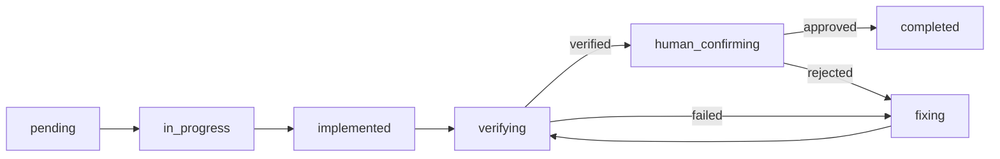

# Develop 开发实施规范

## 概述

此规范定义基于 Plan 文档驱动的开发实施流程，供 `asdm-harness-develop`（Feature 级）和 `asdm-harness-us-develop`（US 级）两个 action 共同参照执行。核心原则：**基于计划、按序推进、闭环验证、人工确认**。两者共用同一套四阶段闭环与状态机；US 级特有的差异（工作区多文件共存、上下文优先级、完成后的跨对象状态回写）见文末「US 级补充说明」章节。

`develop-log.json` 由 `/asdm-harness-plan` 或 `/asdm-harness-us-plan` 在生成对应 Plan 文档时一并初始化，确保开发启动时进度文件已就绪。

## 工作区结构

开发过程的状态数据存放于：

```text
.asdm/workspace/asdm-harness/feat/FT-{id}-{name}/
├── develop-log.json                                    # Feature 级开发进度
├── FT-{id}-{name}-US-01-{us名字}-develop-log.json         # US-01 开发进度
├── FT-{id}-{name}-US-02-{us名字}-develop-log.json         # US-02 开发进度
└── ...
```

> ⚠️ **同一目录下允许 Feature 级与多个 US 级 develop-log.json 并存**。`asdm-harness-develop` 只认目录下唯一的 `develop-log.json`；`asdm-harness-us-develop` 则依据入参中的 US 标识，在目录下精确匹配对应命名的文件，**不假设目录中只有一份进度文件**。两个 action 不应互相读取对方的 develop-log.json。

## 开发状态文件

`develop-log.json` 的完整结构定义参见规范文件 **[develop-log.json](./develop-log.json)**，其中包含每个字段的类型、必填性、约束和示例（含 `scope=feature` 与 `scope=user_story` 两组完整示例）。

### 核心结构速览（Feature 级）

```json
{
  "scope": "feature",
  "feature_id": "FT-001",
  "feature_name": "示例特性",
  "plan_path": ".asdm/workspace/asdm-harness/feat/FT-001-name/FT-001-name-Plan.md",
  "current_phase": 1,
  "current_task": "1.3",
  "tasks": {
    "1.1": {
      "name": "任务名",
      "phase": 1,
      "phase_name": "Phase名称",
      "depends_on": [],
      "status": "pending",
      "history": []
    }
  },
  "last_updated": "2026-05-17T04:00:00+08:00"
}
```

### 核心结构速览（US 级）

US 级在顶层额外携带 `us_id` / `us_card_path` / `story_list_path` 三个字段，`phase`/`phase_name` 固定为 `1`/`"-"`，任务编号无 Phase 前缀。完整字段定义与示例参见 [develop-log.json](./develop-log.json) 的 `complete_example_user_story_scope`，此处不重复列出完整 JSON。

### ⚠️ History 条目格式（与旧版不兼容）

history 数组中的每条记录**必须**使用以下四字段结构：

```json
{"timestamp": "2026-05-17T04:17:00+08:00", "from": "pending", "to": "in_progress", "reason": "用户确认开始"}
```

| 字段 | 类型 | 说明 |
|------|------|------|
| `timestamp` | string | ISO 8601 带时区偏移 |
| `from` | string | 变更前的状态值 |
| `to` | string | 变更后的状态值 |
| `reason` | string | 变更原因描述 |

> ❌ **禁止使用旧格式** `{"step": "...", "result": "...", "detail": "...", "timestamp": "..."}` — 此格式已废弃。本要求对 Feature 级与 US 级同等适用。

### 任务状态流转

```text
pending ──→ in_progress ──→ implemented ──→ verifying
                                                  │
                                           ┌──────┴──────┐
                                           ▼              ▼
                                       verified       fixing ──→ verifying
                                           │              ▲        │
                                           ▼              └────────┘
                                    human_confirming
                                           │
                                    ┌──────┴──────┐
                                    ▼              ▼
                                completed       rejected → fixing
```

状态词含义：

| 状态 | 含义 | 触发条件 |
|------|------|----------|
| `pending` | 等待执行 | 初始状态 |
| `in_progress` | 正在实现 | 用户确认进入后 |
| `implemented` | 编码完成 | AI 完成代码编写 |
| `verifying` | 正在验证 | 进入验证步骤 |
| `verified` | 验证通过 | 所有验证步骤通过 |
| `fixing` | 修复中 | 验证失败或人工否决 |
| `human_confirming` | 等待人工确认 | 验证通过后 |
| `completed` | 已完成 | 人工确认通过 |
| `rejected` | 人工拒绝 | 人工确认不通过 |

> 本状态机及枚举值 Feature 级与 US 级完全共用，US 级未新增任何状态。

## 四阶段闭环流程

每个任务必须严格遵循以下流程，缺一不可：



### 阶段 1: 实现 (Implement)

- Agent 基于 Plan 文档中该任务的描述进行编码
- **上下文来源优先级依 scope 而定**：
  - `scope=feature`：必须读取 PRD 文档和相关 CodeResearch 文件获取完整上下文
  - `scope=user_story`：**优先读取 US 卡片**（用户故事 + AC + 技术依据小节）作为实现上下文；仅当技术依据小节缺失、或当前任务所需信息超出该小节覆盖范围时，才回退读取 PRD 原文相关章节补充
- 完成后写入代码，更新状态为 `implemented`

### 阶段 2: 验证 (Verify)

- Agent 严格按照 Plan 文档中该任务的**验证步骤**逐条执行
- 每条验证步骤须有明确的通过/失败结果
- `scope=user_story` 时，验证结果展示需附带每条验证步骤对应的 AC 编号（Plan 文档中已标注）
- 全部通过 → 状态 `verified`，进入人工确认
- 任何一条失败 → 状态 `fixing`，进入修复阶段

### 阶段 3: 修复 (Fix)

- Agent 分析失败原因并修复代码
- 修复后重新进入验证阶段（见流转图循环）
- **严禁在修复未完成时标注任务为 `completed`**

### 阶段 4: 人工确认 (Human Confirm)

- Agent 展示验证结果摘要
- **必须等待用户明确确认**（"通过"/"确认"/"OK" 等）
- 用户确认 `approved` → 状态 `completed`，更新 Plan 文档
- 用户否决 `rejected` → 状态 `fixing`，返回修复阶段

## Plan 文档状态同步

每个任务 `completed` 后，同步更新 Plan 文档：

1. 更新「进度概要」表中对应任务状态：`⏳` → `✅`
2. Feature 级：更新当前 Phase 的「目标」描述（如有完成百分比等）；US 级无 Phase，跳过此项
3. 在完成提示中显示剩余任务数

## 会话管理

每个任务完成后，Agent **必须**提示用户创建新会话继续：

- Feature 级：`/asdm-harness-develop FT-{id}`
- US 级：`/asdm-harness-us-develop FT-{id} US-{序号}`

**重新进入时的行为**：

1. 读取对应 develop-log.json，定位 `current_task`
2. 若 `current_task` 状态为 `completed`，自动切换到下一个 `pending` 任务
3. 若无 `pending` 任务 → 报告中状态并查找是否有 `rejected` 任务
4. 所有任务 `completed` → Feature 级报告特性开发完成；US 级进入下方「US 级完成判定与状态回写」流程

## 错误处理

| 场景 | 处理方式 |
|------|----------|
| Plan 文档不存在 | 终止，提示先执行 `/asdm-harness-plan`（或 `/asdm-harness-us-plan`） |
| develop-log.json 不存在但 Plan 存在 | 从 Plan 文档初始化，所有任务设为 `pending`；`scope` 依所读取的 Plan 类型设为 `feature` 或 `user_story` |
| 任务在 Plan 中被删除 | 标记为已废弃，跳过 |
| 连续修复 3 次仍失败 | 终止当前任务，标记为 `blocked`，向用户报告阻塞原因 |
| （US 级）入参中的 US 标识在该 Feature 目录下匹配到多个/零个 Plan 文件 | 列出该目录下所有可用 Plan 文件供用户选择或提示先执行 `/asdm-harness-us-plan`，不擅自猜测匹配 |

---

## US 级补充说明

本节汇总 `asdm-harness-us-develop` 相对于上述通用规范的全部差异点，供实现时集中查阅。

### 上下文获取优先级（对应「阶段 1: 实现」）

US 模式下上下文来源顺序与 Feature 模式相反：**US 卡片技术依据小节优先，PRD 是兜底**，而非"PRD 必读"。这是因为 US 卡片的技术依据小节已经是按该 US 范围过滤过的精确信息，直接使用可以避免每个任务都重新解析整篇 PRD。

### US 级完成判定与状态回写

当 `develop-log.json` 的 `scope` 为 `user_story` 时，除通用的四阶段闭环外，**该 US 全部任务 `completed` 后**需额外执行：

1. **回写 US 卡片状态**：读取 `us_card_path` 指向的 US 卡片，将「状态」字段更新为「已完成」
2. **同步 story-list.md**：读取 `story_list_path`，更新该 US 对应行的状态列为「已完成」
3. **跨 US 完成判定**：读取 story-list.md 中该 Feature 下全部 US 的状态列
   - 若仍有 US 未标记「已完成」→ 提示"US-{序号} 开发完成，Feature 下还有 N 个 US 待开发/开发中"，**不触发** Feature 级后续动作（不提示进入测试阶段）
   - 若全部 US 已完成 → 提示"该 Feature 下所有 User Story 均已完成开发，可执行 /asdm-harness-testplan 进入测试验证阶段"

> ⚠️ **单条 US 完成 ≠ Feature 验收完成**。US 级 develop-log.json 不写入 `feature_status`/`review_path`/`review_conclusion`/`review_completion_rate` 字段，这些字段仍只由 Feature 级流程（`asdm-harness-develop`）或验收环节（`/asdm-harness-verify`）维护。即使某 Feature 全程只走 US 级流程（未执行过 Feature 级 Plan/Develop），验收阶段仍按 Feature 粒度统一进行，不因 US 已分别"完成"而跳过。

### 格式一致性检查的 US 级专属项

`asdm-harness-us-develop` 在通用的 (A)-(E) 五项 develop-log.json 格式检查基础上，额外执行：

```python
if log.get('scope') == 'user_story':
    for field in ('us_id', 'us_card_path', 'story_list_path'):
        assert field in log, f"scope=user_story 时顶层缺少必填字段: {field}"
```

未通过时的处理方式与其余五项一致：输出具体不一致项并自动修复，重新校验直到全部通过，且必须在完成提示之前通过。
